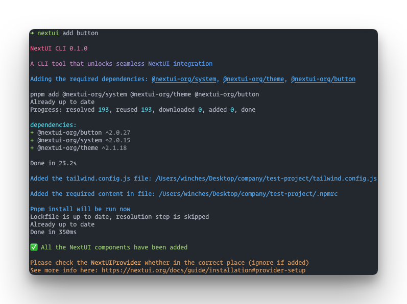
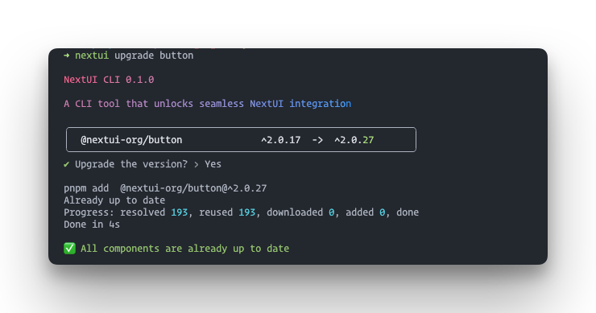
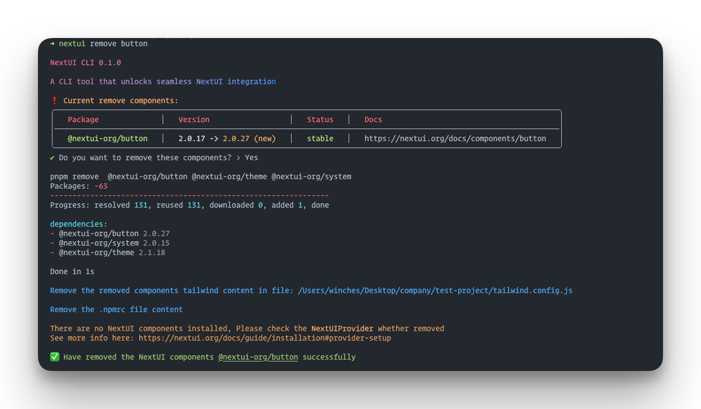
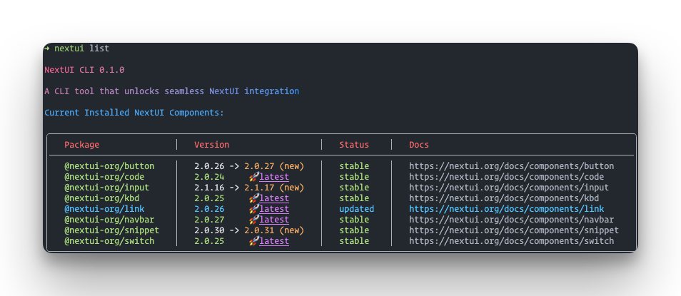
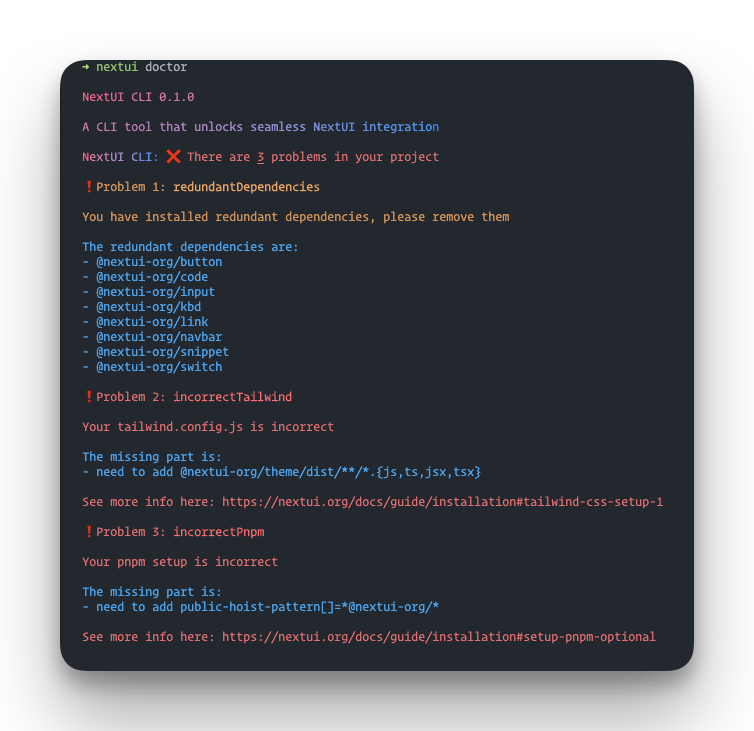
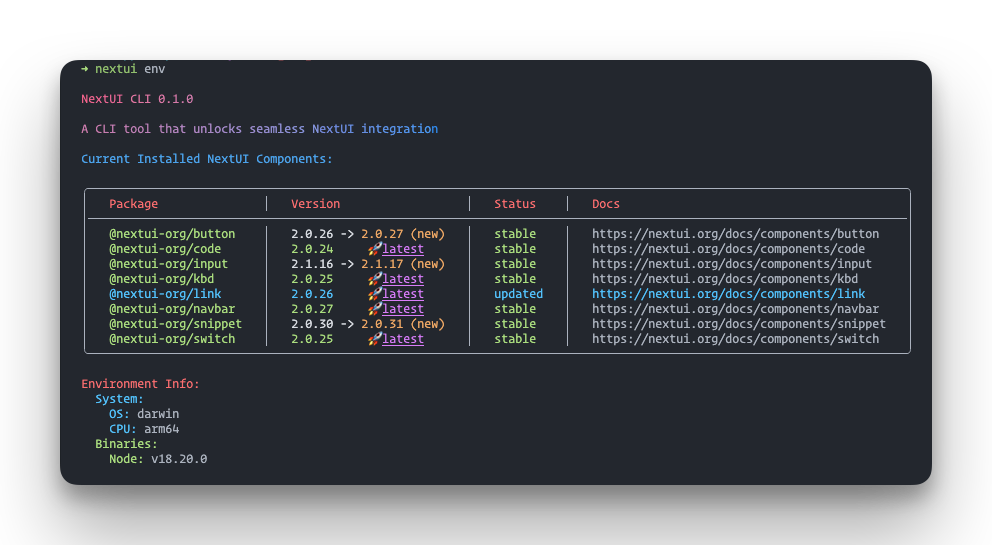

# NextUI CLI

A CLI tool that unlocks seamless NextUI integration

It provides a set of commands to help you easily manage your NextUI project.

## 🚀 Quick Start

> **Note**: The NextUI CLI requires [Node.js](https://nodejs.org/en) _18.17.x+_ or later

You can choose the following ways to start the NextUI CLI.

### Npx

```bash
npx nextui-cli@latest
```

### Global Installation

```bash
npm install -g @nextui/cli
```

## 📖 Usage

```bash
nextui [command]

Options:
  -v, --version                      Output the current version
  -h, --help                         Display help for command

Commands:
  init [options] [projectName]       Initialize a new NextUI project
  add [options] [components...]      Add NextUI components to your project
  upgrade [options] [components...]  Upgrade the NextUI components to the latest version
  remove [options] [components...]   Remove NextUI components from your project
  list [options]                     List all the components status, description, version, etc
  env [options]                      Display debug information about the local environment
  doctor [options]                   Check whether exist problem in user project
  help [command]                     display help for command
```

## 📦 Commands

### Init

Initialize a new NextUI project with official templates.

```bash
nextui init [projectName] [options]
```

#### Init Options

- `-t --template [string]` The template to use for the new project e.g. app, pages

##### Example

```bash
# Initialize a new NextUI project with the app template, named my-nextui-app
nextui init my-nextui-app -t app
```

### Add

Add NextUI components to your project.

#### Features

> 1. Auto add the missing required `dependencies` to your project
> 2. Auto add the required `tailwindcss.config.js` configuration to your project
> 3. Detect whether using pnpm, if so, add the required configuration to your `.npmrc` file

```bash
nextui add [components...] [options]
```

#### Add Options

- `-a --all` [boolean] Add all the NextUI components (default: `false`)
- `-p --packagePath` [string] The path to the package.json file
- `-tw --tailwindPath` [string] The path to the tailwind.config file file
- `-app --appPath` [string] The path to the App.tsx file
- `--prettier` [boolean] Add prettier format in the add content which required installed prettier - (default: false)
- `--addApp` [boolean] Add App.tsx file content which required provider (default: `false`)

##### Example

Add the **Button** component to your project.

<pre align="center">nextui add <b>Button</b></pre>

<p align="center">

</p>

### Upgrade

Upgrade the NextUI components to the latest version.

```bash
nextui upgrade [components...] [options]
```

#### Upgrade Options

- `-p --packagePath` [string] The path to the package.json file
- `-a --all` [boolean] Upgrade all the NextUI components (default: `false`)
- `-h, --help` Display help for command

##### Example

Upgrade the **Button** component to the latest version.

<pre align="center">nextui upgrade <b>Button</b></pre>

<p align="center">

</p>

### Remove

Remove NextUI components from your project.

> **Note**: If there are no NextUI components after removing, the required content will also be removed

```bash
nextui remove [components...] [options]
```

#### Remove Options

- `-p --packagePath` [string] The path to the package.json file
- `-a --all` [boolean] Remove all the NextUI components (default: `false`)
- `-tw --tailwindPath` [string] The path to the tailwind.config file file
- `--prettier` [boolean] Add prettier format in the add content which required installed prettier - (default: false)

##### Example

Remove the **Button** component from your project.

<pre align="center">nextui remove <b>Button</b></pre>

<p align="center">

</p>

### List

List all the NextUI components.

```bash
nextui list [options]
```

#### List Options

- `-p --packagePath` [string] The path to the package.json file
- `-c --current` List the current installed components

##### Example

Show `all NextUI components` of the current project.

<pre align="center">nextui list</pre>

<p align="center">

</p>

### Doctor

Check whether exist problem in your project by using the `doctor` command.

```bash
nextui doctor [options]
```

### Features

> 1. Check whether have `redundant dependencies` in the project
> 2. Check whether the NextUI components `required dependencies are installed` in the project
> 3. Check the required `tailwind.config.js` file and the content is correct
> 4. Check `.npmrc` is correct when using `pnpm`

#### Doctor Options

- `-p` `--packagePath` [string] The path to the package.json file
- `-tw` `--tailwindPath` [string] The path to the tailwind.config file file
- `-app` `--appPath` [string] The path to the App.tsx file
- `-ca` `--checkApp` [boolean] Open check App (default: `true`)
- `-ct` `--checkTailwind` [boolean] Open check tailwind.config file (default: `true`)
- `-cp` `--checkPnpm` [boolean] Open check Pnpm (default: `true`)

#### Example

<pre align="center">nextui doctor</pre>

<p align="center">

</p>

### Env

Display debug information about the local environment.

```bash
nextui env [options]
```

#### Env Options

- `-p --packagePath` [string] The path to the package.json file

#### Example

Display the local environment Information by using the `env` command.

<pre align="center">nextui doctor</pre>

<p align="center">

</p>
